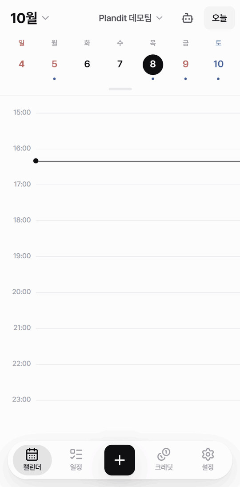
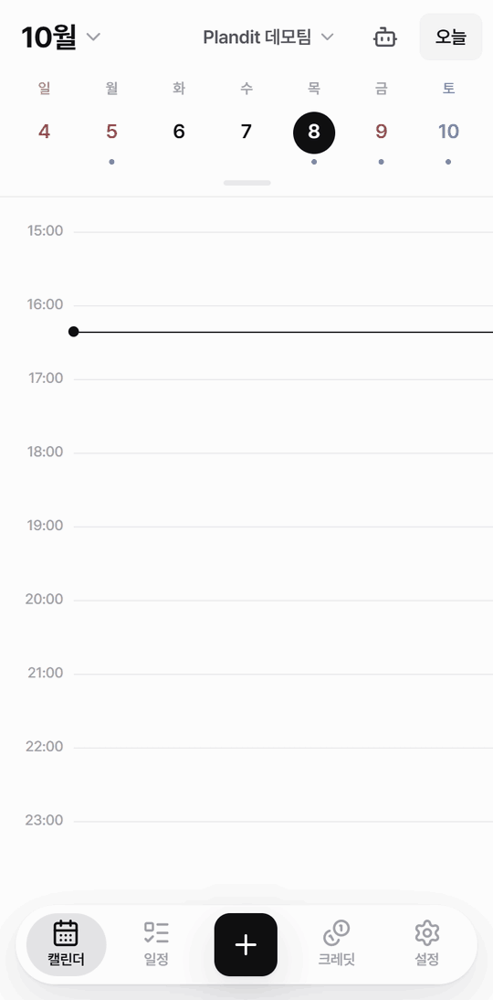
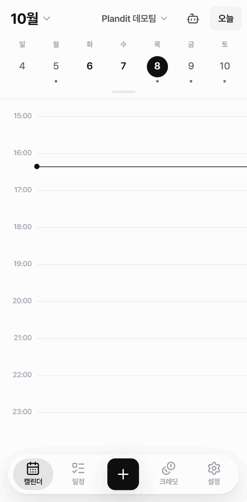
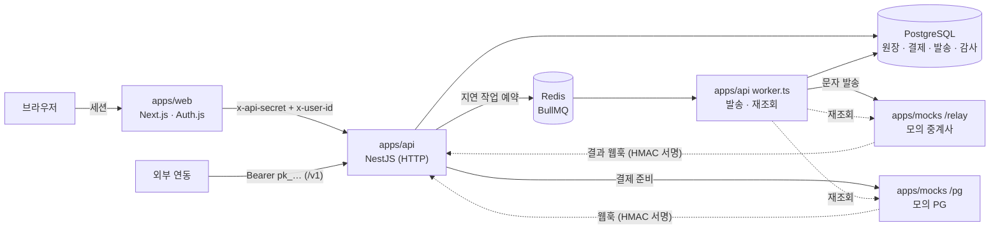
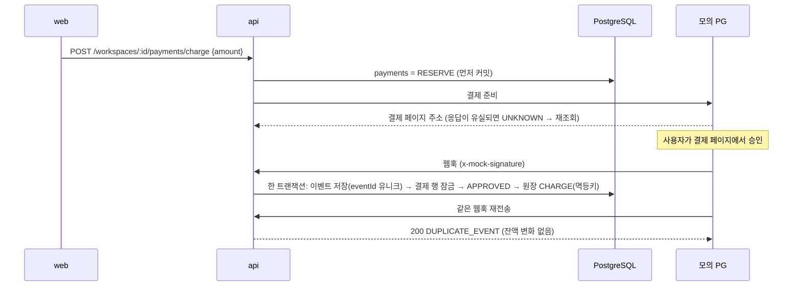

# Plandit

> **웹훅이 두 번 와도, 안 와도, 잔액은 한 번만 바뀝니다.**

팀 캘린더 위에 **크레딧 과금 · 모의 PG 결제 · 큐 기반 문자 리마인더 · 워크스페이스 권한**을 얹은 포트폴리오 프로젝트입니다.
실제 결제와 실제 문자 발송은 없습니다. 모의 외부 서버(`apps/mocks`)가 PG와 문자 중계사 역할을 하며, 진짜처럼 **비동기 웹훅을 늦게, 두 번, 혹은 아예 안** 보냅니다.

- 돈: 추가만 되는 원장, 멱등키, 행 잠금, 외부 호출 전 선기록, 재조회로 확정 → [설계 결정](#설계-결정)
- 큐: BullMQ 지연 작업, 일정이 옮겨져도 한 번만 발송, 초당 제한(429) 재시도, 실패 시 자동 환불
- 권한: 워크스페이스 역할(결제·멤버) + 캘린더 역할(데이터), 감사 로그, 공개 API 키(스코프·요청 수 제한)
- AI: 토큰 기준 크레딧 과금(선차감 → 정산), 도구 호출 에이전트(일정 변경은 승인 뒤에만), 회의록 RAG(pgvector, 무료 로컬 임베딩), 같은 도구를 내보내는 MCP 서버
- 운영: 요청마다 추적 id(로그 → 작업 → 감사 기록까지), Prometheus 지표, 매일 원장 정합성 검사(`pnpm check:ledger`), [장애 대응 런북](docs/runbook.md), [겪은 문제 기록](docs/troubleshooting.md)

## 데모

| 일정 잡기 (Tool Calling) | 회의록 검색 (RAG) | 여행 초안 말로 고치기 |
| :-: | :-: | :-: |
|  |  |  |
| 캘린더 확인 → 빈 시간 찾기 → 만들 일정 카드. **"만들기"를 눌러야** 들어가요 | 볼 수 있는 일정의 회의록 조각을 찾아(pgvector) 근거와 함께 답해요 | AI가 고친 초안은 제안으로만 저장. 바뀐 곳(새로·빠짐)을 보고 반영해요 |

> 키 없이 도는 모의 모델(`LLM_PROVIDER=mock`)로 375px 화면을 녹화했습니다. 모델 자리만 정해진 대본(어떤 도구를 부를지, 답 문장)이고, 도구 실행·크레딧 선차감과 정산·승인 대기·임베딩 검색은 실제 코드 그대로입니다.

## 구조



- 브라우저는 web만 부릅니다. web이 세션을 확인하고 내부 헤더로 api를 부릅니다(`app/api/[...path]` 프록시 하나).
- 외부에서 api로 직접 들어오는 길은 **웹훅(서명)** 과 **공개 API `/v1`(API 키, MCP 서버 `/v1/mcp` 포함)** 두 가지뿐입니다.
- 워커는 api와 같은 코드베이스의 다른 진입점(`worker.ts`)입니다. 서비스 코드를 그대로 공유합니다.

충전 한 건은 이렇게 흐릅니다.



## 빠르게 실행

필요한 것: Node.js 24, pnpm 11, Docker.

```bash
pnpm install && cp .env.example .env
docker compose up -d && pnpm prisma:migrate && pnpm seed:demo
pnpm dev
```

| 주소 | 내용 |
| --- | --- |
| http://localhost:3000 | 웹앱. 데모 계정 `demo@plandit.dev`, 비밀번호는 `.env.example`의 `DEMO_PASSWORD` |
| http://localhost:4000/docs | API 문서(Swagger). 요청·응답 예시, 오류 형식, 경로별 인증 방식 |
| http://localhost:4100/pg/admin | 모의 PG 거래·웹훅 기록 |
| http://localhost:4100/inbox?phone=010-0000-0001 | 가상 수신함(데모 계정 번호로 "도착"한 문자) |

`pnpm seed:demo`는 데모 계정 2개(`demo@plandit.dev`, `teammate@plandit.dev`), 팀 워크스페이스 "Plandit 데모팀"(크레딧 300), 이번 주 일정을 만듭니다. 여러 번 실행해도 한 번만 만듭니다.

### 인터넷에 공개하기

무료 서버 한 대(Oracle Cloud)에 도커로 전부 띄우고 무료 주소(DuckDNS)와 HTTPS(Caddy)를 붙이는 방법은 [docs/deploy.md](docs/deploy.md)에 있습니다. main에 합치면 GitHub Actions가 검사 후 서버에 자동 배포합니다(설정한 경우).

## 10분 시나리오

### 1. 충전 — 웹훅이 두 번 와도 한 번만 (3분)

1. 데모 계정으로 로그인 → 아래 탭 **크레딧**. 위쪽 워크스페이스가 "Plandit 데모팀"인지 확인합니다.
2. **충전하기** → **10,000원** → **10,000원 결제하기**. 모의 PG 결제 페이지에서 **결제 승인**을 누릅니다.
3. 결제 결과 화면이 "1,000 크레딧"을 보여 주고, 크레딧 화면 잔액이 1,000 늘어납니다. **사용 내역**에 충전 1행, **결제** 탭에 완료 1건이 생깁니다.
4. 이번에는 직접 입력에 **10003**(끝 두 자리 `03`)을 넣고 결제·승인합니다. 모의 PG는 같은 웹훅을 **두 번** 보냅니다.
   - http://localhost:4100/pg/admin 의 "웹훅 발송/이벤트" 칸이 `2/1`입니다. 같은 이벤트를 두 번 보냈다는 뜻입니다.
   - 잔액은 1,000만 늘고, 사용 내역도 1행만 생깁니다.

### 2. 문자 리마인더 — 차감, 발송, 실패하면 환불 (5분)

1. 아래 탭 **캘린더**에서 빈 시간을 눌러 새 일정을 만듭니다.
   - 시작 시각은 **지금 다음의 15분 단위 시각**으로 바꿉니다(예: 지금 18:07이면 18:15).
   - 캘린더는 **팀 일정**만 고릅니다. "내 캘린더"는 한 번 눌러 끕니다. 문자 비용은 캘린더가 속한 워크스페이스의 크레딧에서 나갑니다.
   - **알림**을 누르고 방법을 **문자**로 둡니다. 알림 시점은 시작까지 남은 시간에 맞춰 고릅니다. 그러면 1~5분 안에 발송됩니다.

     | 시작까지 남은 시간 | 알림 시점 |
     | --- | --- |
     | 11분 이상 | 10분 전 |
     | 6~10분 | 5분 전 |
     | 5분 이하 | 시작할 때 |
2. 알림 시각이 되면 워커가 크레딧 1을 먼저 차감하고 모의 중계사로 보냅니다. 3초쯤 뒤 결과 웹훅이 옵니다.
   - http://localhost:4100/inbox?phone=010-0000-0001 에 `[Plandit] …` 문자가 도착합니다.
   - **크레딧 → 알림 발송** 탭에서 상태가 "전달"로, **사용 내역**에 차감 1행이 보입니다.
3. 실패와 환불을 보려면 **설정 → 휴대폰 번호**를 `010-0000-0009`로 바꾸고 1번을 다시 합니다.
   - 모의 중계사가 `INVALID_NUMBER`로 실패를 알립니다.
   - 발송 내역에 "실패 · 환불됨"이 뜨고, 사용 내역에 차감 1행과 환불 1행이 함께 보입니다.
   - 끝나면 번호를 `010-0000-0001`로 되돌려 주세요.

> 모의 중계사는 기본으로 10%를 무작위로 실패시킵니다(`RELAY_FAIL_RATE`). 정상 번호인데 실패했다면 이 경우이고, 역시 환불됩니다.
> **개인** 캘린더에 문자 알림을 걸면 개인 워크스페이스 잔액이 0이라 **건너뜀**(차감 없음)으로 끝나고 푸시로 대신 알립니다.

### 3. 더 해볼 것 (선택)

- **웹훅 누락 → 재조회로 확정**: 금액 끝을 `05`로 충전하면 모의 PG가 웹훅을 보내지 않습니다. 결제 결과 화면은 "확인이 늦어지고 있어요"에서 멈추고, 결제 탭에는 "결제 대기"로 남습니다. 그 뒤 워커의 재조회 작업이 PG에 다시 물어 승인합니다. 기본값으로는 결제 5분 경과 후 1분 주기라 최대 6분쯤 걸립니다. `.env`의 `RECONCILE_MIN_AGE_MS=30000`으로 줄일 수 있습니다.
- **일정 옮기기**: 문자 알림이 걸린 일정을 끌어서 다른 시각으로 옮기면 옛 시각에는 아무것도 나가지 않고 새 시각에 한 번 나갑니다.
- **AI 일정 비서**: 캘린더 위 워크스페이스를 **Plandit 데모팀**으로 고르고(비서는 보고 있는 워크스페이스의 크레딧을 씁니다. "전체"에서는 잔액 0인 개인 워크스페이스), 비서 아이콘을 눌러 "내일 오후에 1시간 회의 잡아줘"를 보냅니다. 키 없이 도는 모의 모델(`LLM_PROVIDER=mock`)이 실제 도구로 캘린더를 확인하고 내일 오후 빈 시간을 찾아 회의를 제안합니다. "만들기"를 눌러야 일정이 생기고, 호출마다 쓴 크레딧만 빠집니다.
- **공개 API**: 설정 → 워크스페이스 → API 키 발급 후 `curl -H "Authorization: Bearer pk_…" http://localhost:4000/v1/events`로 부릅니다. 요청 수 제한을 넘으면 429와 `Retry-After`가 옵니다.
- **회의록 검색**: 데모팀 워크스페이스로 비서에게 "A사랑 출시 언제로 정했지?"를 물으면 지난주 "A사 킥오프 미팅" 회의록을 찾아 근거와 함께 답합니다. 일정 편집 시트의 "회의록 첨부"로 PDF·TXT·MD를 붙일 수 있고, 워커가 처음 임베딩할 때 무료 모델 파일(약 120MB)을 한 번 받습니다.
- **MCP로 연결하기**: `events:read`(일정을 만들게 하려면 `events:write`도) 스코프로 키를 발급하고 Claude Code에 서버를 추가합니다. 비서와 같은 도구 6개(캘린더·멤버·일정 조회, 빈 시간 찾기, 회의록 찾기, 일정 만들기)가 그 키의 워크스페이스 범위로 보이고, 크레딧은 쓰지 않습니다. 배포 서버라면 주소만 `https://<도메인>/v1/mcp`로 바꿉니다.
  ```bash
  claude mcp add --transport http plandit http://localhost:4000/v1/mcp --header "Authorization: Bearer pk_…"
  ```

## 시나리오와 테스트

아래는 전부 **실제 Postgres·Redis·BullMQ 워커·모의 서버 프로세스**를 띄운 e2e 테스트로 지키고 있습니다.

| 시나리오 | 재현 방법 | 기대 결과 | 테스트 |
| --- | --- | --- | --- |
| 정상 충전 | 금액 끝 `00` | 결제 APPROVED, 원장 CHARGE 1행 | `payments.e2e-spec.ts` |
| 웹훅 두 번 | 금액 끝 `03` | 이벤트 1행, 원장 1행 | `payments.e2e-spec.ts` |
| 승인 실패 | 금액 끝 `01` | FAILED, 원장 변화 없음 | `payments.e2e-spec.ts` |
| PG가 죽어 있음 | PG 프로세스 중지 | 502 + 결제 UNKNOWN, 재조회 대상 | `payments.e2e-spec.ts` |
| 웹훅 누락 | 금액 끝 `05` | 재조회로 APPROVED, 늦게 온 웹훅은 `ALREADY_APPLIED` | `reconcile.e2e-spec.ts` |
| 위조 웹훅 | 서명 없이 호출 | 401, 아무것도 바뀌지 않음 | `payments`, `reminders` |
| 동시 차감 | 잔액 30에 1크레딧 차감 50개 동시 | 정확히 30개 성공, `balanceAfter` 29→0 | `credits.e2e-spec.ts` |
| 원장 정합성 검사 | `pnpm check:ledger`(워커는 매일 05:00) | 원장 합계 = 잔액, 행마다 잔액이 누계와 같음. 어긋나면 그 계정·행을 짚고 종료 코드 1 | `ledger-check.e2e-spec.ts` |
| 문자 발송 | 문자 알림 | 차감 1 → 전달, 수신함 도착 | `reminders.e2e-spec.ts` |
| 대량 발송·실패 | 100명 중 30명 실패, 초당 제한 | 429 재시도 발생, `차감 = 성공 + 환불`, 이중 환불 0 | `reminders.e2e-spec.ts` |
| 결과 웹훅 재전송 | 같은 결과 두 번 | 환불 1행 | `reminders.e2e-spec.ts` |
| 일정 이동 | 알림 있는 일정 시간 변경 | 옛 시각 0건, 새 시각 작업 존재 | `reminders.e2e-spec.ts` |
| 잔액 부족 | 잔액 0에서 문자 알림 | 건너뜀, 차감 없음, 푸시 대체 | `reminders.e2e-spec.ts` |
| 권한 | MEMBER가 역할 변경, 비멤버 조회 | 403 / 404(존재 숨김) | `workspaces.e2e-spec.ts` |
| 캘린더 권한 | VIEWER의 캘린더·일정 수정, EDITOR의 멤버 관리, 비멤버·남의 비공개 일정 | 403 / 404(존재 숨김) | `calendars.e2e-spec.ts` |
| 감사 로그 | 성공한 변경, 거절·재시도 | 변경당 정확히 1행, 거절·재시도 0행 | `audit.e2e-spec.ts` |
| API 키 | 폐기·만료·스코프 없음·한도 초과 | 401 / 403 / 429 | `api-keys.e2e-spec.ts` |
| MCP 서버 | 스코프가 다른 키로 MCP 클라이언트 연결 | 부를 수 있는 도구만 보임, 키의 워크스페이스 일정만, `events:write` 없으면 일정 만들기 거절 | `mcp.e2e-spec.ts` |
| AI 비서 승인 | 비서가 제안한 일정에 "만들기"를 세 번 동시에 | 승인 전 0건, 승인 후 정확히 1건 | `assistant.e2e-spec.ts` |
| AI 비서 권한 | 승인 기다리는 사이 캘린더 역할이 VIEWER로 | 실행 안 함, 이유를 AI에 전달 | `assistant.e2e-spec.ts` |
| AI 비서 과금 | 단계 중 LLM 오류·잔액 부족·단계 한도 | 실패한 호출만 전액 환불, 사용 건마다 `DEBIT + ADJUST + REFUND = −credits` | `assistant.e2e-spec.ts` |
| AI 월 한도 | 한도가 선차감 2건분일 때 AI 예약 5개 동시 | 정확히 2건 통과, 나머지 409 `AI_MONTHLY_LIMIT`·원장 변화 없음 | `ai-limit.e2e-spec.ts` |
| 여행 초안 말로 고치기 | 요청한 뒤 손으로 초안을 고치고 AI 제안을 반영 | 409 `TRIP_DRAFT_CHANGED`, 손으로 고친 것 유지. 같은 요청 동시 3번은 1건 | `trip-plans.e2e-spec.ts` |
| 회의록 검색 권한 | 같은 질문을 팀원·외부인·워크스페이스 범위 키로 | 볼 수 있는 일정의 회의록만 근거로 나옴, 남의 비공개 일정은 0건 | `memory.e2e-spec.ts` |

## 테스트 실행

```bash
docker compose up -d        # e2e는 실제 DB·Redis를 씁니다(별도 DB plandit_test, Redis DB 1)
pnpm lint && pnpm typecheck && pnpm test && pnpm test:e2e
```

- `pnpm test`: 단위 테스트(원장 부호 규칙, 서명 검증, 역할 판정, 발송 시각 계산, 달력 배치 계산, AI 크레딧 환산, 로컬 가짜 서버로 Claude 어댑터)
- `pnpm test:e2e`: api e2e(모의 PG·중계사 프로세스와 BullMQ 워커를 테스트가 직접 띄움) + 모의 서버 테스트
- 네 가지가 모두 통과해야 커밋합니다.

## 설계 결정

| 번호 | 결정 |
| --- | --- |
| [0001](docs/adr/0001-ledger-append-only.md) | 크레딧 원장은 추가만 하고, 잔액은 원장에서 파생된 캐시로 둔다 |
| [0002](docs/adr/0002-reserve-before-external-call.md) | 외부 서비스를 부르기 전에 우리 쪽 상태를 먼저 기록한다(RESERVE·QUEUED → 재조회로 확정) |
| [0003](docs/adr/0003-webhook-idempotency.md) | 웹훅은 서명을 확인하고, 이벤트 id와 원장 멱등키로 두 번 걸러낸다 |
| [0004](docs/adr/0004-reminder-job-versioning.md) | 리마인더 예약 작업은 발송 시각을 id에 담고, 옛 작업은 실행할 때 스스로 버린다 |
| [0005](docs/adr/0005-ai-credit-reserve-settle.md) | AI 호출은 최대 금액을 먼저 잡고, 끝나면 쓴 만큼만 청구한다(실패하면 전액 환불) |
| [0006](docs/adr/0006-assistant-persisted-tool-loop.md) | AI 일정 비서의 도구 호출 루프는 한 단계씩 DB에 남기며 진행하고, 일정 변경은 승인 뒤에만 실행한다 |

더 짧은 요약과 이슈별 완료 조건은 [docs/PLAN.md](docs/PLAN.md), 데이터 모델은 [docs/ERD.md](docs/ERD.md)에 있습니다.

## 채용 공고 용어와 대응

| 공고에서 | Plandit에서 |
| --- | --- |
| 조직 | **워크스페이스**. 가입하면 개인 워크스페이스가 생기고, 팀은 워크스페이스를 만들어 멤버를 초대합니다. 크레딧·결제의 주인입니다 |
| 스페이스 | **캘린더**. 모든 캘린더는 워크스페이스 하나에 속합니다 |
| 권한 | **워크스페이스 역할**(OWNER > ADMIN > MEMBER: 결제·크레딧·멤버 관리) + **캘린더 역할**(OWNER·ADMIN·EDITOR·VIEWER: 일정 데이터). 둘을 섞지 않습니다 |
| 크레딧·결제 | 원장([0001](docs/adr/0001-ledger-append-only.md)), 모의 PG 충전·웹훅·재조회([0002](docs/adr/0002-reserve-before-external-call.md), [0003](docs/adr/0003-webhook-idempotency.md)) |
| Redis/Queue | BullMQ 리마인더 발송·재조회 작업([0004](docs/adr/0004-reminder-job-versioning.md)) |
| LLM · RAG · Tool Calling · MCP | `LlmClient` + Claude 어댑터와 토큰 기준 크레딧 과금(선차감 → 정산, 실패 환불, [0005](docs/adr/0005-ai-credit-reserve-settle.md)). AI 여행 일정: 목적지·기간·함께 갈 멤버로 초안을 만들고 확인 후 캘린더에 한 번에 넣기(구조화 출력, 참석자 캘린더 권한 자동 추가). AI 일정 비서: 도구 호출 루프(캘린더·일정 조회, 빈 시간 찾기, 일정 만들기)를 한 단계씩 DB에 남기며 워커가 진행하고, 일정 변경은 사용자 승인 뒤에만 실행([0006](docs/adr/0006-assistant-persisted-tool-loop.md)). 같은 도구를 MCP 서버(`/v1/mcp`, API 키·스코프)로도 내보냄. 워크스페이스별 AI 월 한도(동시 요청으로도 넘지 않음). 여행 초안을 "둘째 날 오후는 쉬게 해줘"처럼 말로 고치면 AI의 제안을 미리보기로 보고 반영. 회의록 RAG: 일정에 PDF·TXT를 붙이면 글자만 조각으로 저장해 임베딩(pgvector, 서버 CPU의 무료 다국어 모델)하고, 비서의 `search_memory`가 볼 수 있는 일정의 회의록만 찾아 근거와 함께 답함 → [PLAN.md](docs/PLAN.md#2주차--ai-일정-비서-개요) |

## AI 개발 도구로 일한 방식

이 프로젝트는 Claude Code(Anthropic의 코딩 에이전트)와 함께 만들었습니다. 먼저 [CLAUDE.md](CLAUDE.md)에 지켜야 할 규칙을 적었습니다.
- 돈에 관한 규칙: 잔액 직접 UPDATE 금지, 원장은 `LedgerService.append()`만, 외부 호출 전 선기록, 웹훅은 서명·이벤트 id·같은 트랜잭션
- 권한 규칙
- 커밋 전 검증(`lint · typecheck · test · test:e2e` 넷 다 통과)

작업은 이슈 하나씩 진행했습니다. [docs/PLAN.md](docs/PLAN.md)에 이슈마다 완료 조건을 먼저 정하고, 브랜치 하나에서 구현하고, 조건을 만족하는 테스트가 통과해야 체크했습니다.
에이전트가 코드를 쓰더라도 무엇을 보장해야 하는지는 사람이 정했습니다. "동시 차감 50개 중 정확히 30개", "웹훅 두 번에도 원장 1행"처럼 실패 시나리오를 성공 시나리오만큼 먼저 적었고, 그 결과가 위 표의 e2e 테스트입니다.
설계 선택과 화면은 사람이 검토하고 되돌렸습니다. 작업 중 겪은 문제와 원인은 [docs/troubleshooting.md](docs/troubleshooting.md)에 그대로 남겼습니다.

## 기술 스택

- Node.js 24 · pnpm 11 워크스페이스 · TypeScript 6
- NestJS 11 · Next.js 16 · React 19 · Tailwind CSS 4
- PostgreSQL 18(pgvector) · Prisma 7 · Redis 7.4 · BullMQ
- Auth.js(이메일·Google·Kakao·Naver) · Web Push
- AI: Anthropic SDK(기본은 모의 모델) · MCP SDK · Transformers.js + ONNX Runtime(로컬 임베딩) · unpdf
- 테스트: Jest(@swc/jest) · Supertest · Node 내장 테스트 러너 / 운영: nestjs-pino · prom-client

## 폴더

```txt
apps/web            Next.js 웹앱 — 화면, Auth.js 세션, api 프록시
apps/api            NestJS — HTTP 진입점 main.ts, 워커 진입점 worker.ts
apps/mocks          모의 PG·문자 중계사(Express, api 코드를 import하지 않음) — 사용법 apps/mocks/README.md
packages/database   Prisma 스키마·마이그레이션
packages/shared     zod 스키마·상수(api와 web이 함께 씀)
docs/               계획, ERD, 설계 결정(adr), 런북, 문제 기록
```

## 캘린더 기능

개인·공유 캘린더, 멤버 초대와 역할, 공개 일정 링크, 웹 푸시, 중요 일정 표시.
화면은 모바일 우선입니다. 하루 타임라인에서 빈 시간을 누르거나 끌어서 일정을 만들고, 일정을 끌어 옮기거나 길이를 바꿉니다. 삭제·이동은 "되돌리기"로 취소할 수 있습니다.
토·일·공휴일(관보 기준)을 표시하고, 워크스페이스별로 모아 볼 수 있습니다. 일정 모델은 [docs/PRODUCT_MODEL.md](docs/PRODUCT_MODEL.md)를 참고하세요.
