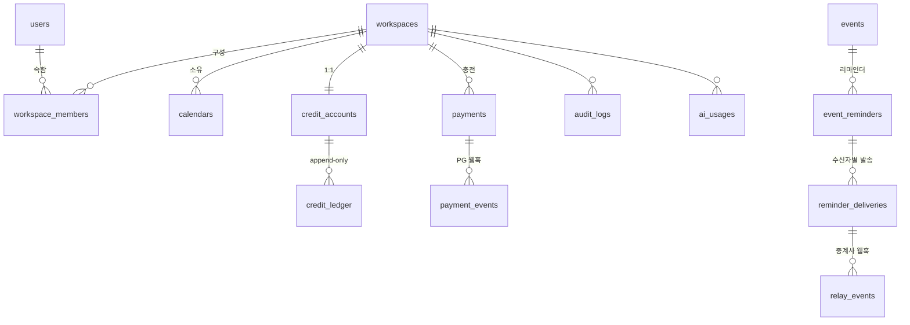

# Plandit 데이터 모델 — 확장분

기존 캘린더 모델(`User`, `Calendar`, `CalendarMember`, `Event`, `EventShare`, `PushSubscription` …)은 `packages/database/prisma/schema.prisma`가 기준이다.
이 문서는 **추가·변경되는 테이블**만 적는다. 1주차 범위는 ★.
ID는 기존과 같이 `cuid`. 시간순이 중요한 로그성 테이블(원장·이벤트·감사)만 `bigserial`.

## 관계

## ★ 변경되는 기존 테이블

### users
| 추가 컬럼 | 타입 | 비고 |
|---|---|---|
| phone | text null | 문자 리마인더 수신번호. 시드는 `010-0000-xxxx`만 |

### calendars
| 추가 컬럼 | 타입 | 비고 |
|---|---|---|
| workspace_id | FK workspaces | 마이그레이션 1단계 null 허용 → 백필(OWNER의 개인 워크스페이스) → 2단계 NOT NULL |

캘린더 역할(`CalendarRole`)은 그대로 둔다. 캘린더 안의 읽기/쓰기 권한은 캘린더 역할, 결제·크레딧·멤버 관리는 워크스페이스 역할.

## ★ 1주차 추가 테이블

### workspaces
| 컬럼 | 타입 | 비고 |
|---|---|---|
| id | cuid PK | |
| name | text | |
| type | enum PERSONAL / TEAM | 가입 시 PERSONAL 1개 자동 생성 |
| personal_owner_id | FK users unique null | PERSONAL일 때만. 사용자당 개인 워크스페이스 1개를 DB가 보장 |
| created_at, updated_at | | |

### workspace_members
| 컬럼 | 타입 | 비고 |
|---|---|---|
| id | cuid PK | |
| workspace_id | FK | |
| user_id | FK users | |
| role | enum OWNER / ADMIN / MEMBER | `WorkspaceRole.covers(other)` |
| created_at | | |
| unique(workspace_id, user_id) | | |

규칙: 초대·역할 변경·제거는 ADMIN 이상이 자기 역할 이하로만. 본인 역할은 못 바꾼다. PERSONAL 워크스페이스는 멤버 추가 불가.

### credit_accounts — 워크스페이스당 하나
| 컬럼 | 타입 | 비고 |
|---|---|---|
| id | cuid PK | |
| workspace_id | FK unique | 워크스페이스 생성과 같은 트랜잭션 |
| balance | bigint | **원장에서 파생된 캐시** |
| updated_at | | |

### credit_ledger — append-only 원장
| 컬럼 | 타입 | 비고 |
|---|---|---|
| id | bigserial PK | 시간순 |
| account_id | FK | |
| type | enum CHARGE / DEBIT / REFUND / ADJUST | |
| amount | bigint | 부호 있음. CHARGE·REFUND 양수, DEBIT 음수 |
| balance_after | bigint | 기록 시점 잔액 |
| ref_type | enum PAYMENT / REMINDER_DELIVERY / AI_USAGE / MANUAL | |
| ref_id | text | 원인 객체 id |
| idempotency_key | text unique | `"{ref_type}:{ref_id}:{type}"` |
| memo | text null | |
| created_by | FK users null | 수동 조정 시 관리자 |
| created_at | | |

인덱스: (account_id, id desc), (ref_type, ref_id). UPDATE·DELETE는 트리거로 차단. 정정은 ADJUST 행 추가.

### payments — 충전 거래
| 컬럼 | 타입 | 비고 |
|---|---|---|
| id | cuid PK | |
| workspace_id, account_id | FK | |
| trade_id | text unique | `P{yyMMdd}-{seq}`, PG에 넘기는 값. seq는 DB 시퀀스 `payment_trade_seq` |
| provider | enum MOCK_PG | 확장: TOSS 등 |
| amount | int | 결제 금액(원) |
| credits | bigint | 지급 크레딧 |
| status | enum RESERVE / APPROVED / FAILED / CANCELED / UNKNOWN | |
| provider_tx_id | text unique null | PG 거래번호 |
| payment_page_url, method | text null | |
| failure_code, failure_message | text null | |
| requested_by | FK users | |
| created_at | timestamptz | = RESERVE 기록 시각(PG 호출 전) |
| approved_at, failed_at, canceled_at | timestamptz null | |
| ledger_id | FK credit_ledger null | 승인 시 CHARGE 행 |

상태 전이: RESERVE → APPROVED / FAILED / UNKNOWN; UNKNOWN → APPROVED / FAILED; APPROVED → CANCELED.

### payment_events — PG 웹훅 수신 기록
| 컬럼 | 타입 | 비고 |
|---|---|---|
| id | bigserial PK | |
| payment_id | FK null | trade_id로 못 찾은 이벤트도 남긴다 |
| event_id | text unique | 중복 수신 차단 키 |
| event_type | text | APPROVED / FAILED / CANCELED |
| payload | jsonb | 원문 |
| result | text | 처리 결과: APPLIED / ALREADY_APPLIED / UNKNOWN_PAYMENT / AMOUNT_MISMATCH / CONFLICT_STATE / UNHANDLED |
| received_at | | |

서명 실패 요청은 저장하지 않고 401(로그만). 같은 event_id 재수신은 INSERT가 무시되어 아무 처리도 하지 않는다.

### event_reminders — 일정별 리마인더 설정
| 컬럼 | 타입 | 비고 |
|---|---|---|
| id | cuid PK | |
| event_id | FK events (cascade) | |
| minutes_before | int | 0 ~ 10080(7일) |
| channel | enum PUSH / SMS / ALIMTALK | |
| audience | enum CREATOR / ATTENDEES | 받는 사람 범위 |
| created_by | FK users | |
| unique(event_id, minutes_before, channel) | | |

발송 시각 = `events.starts_at - minutes_before`(종일 일정은 캘린더 타임존 09:00 기준). 일정 시각이 바뀌면 새 jobId(`fire_{id}_{발송시각}`)로 예약하고, 옛 작업은 실행 시 현재 발송 시각과 달라 무시된다.

### reminder_deliveries — 수신자별 발송 건
| 컬럼 | 타입 | 비고 |
|---|---|---|
| id | cuid PK | |
| reminder_id | FK null | 일정·리마인더가 삭제돼도 발송 건은 남긴다(SetNull). 원장 행을 참조하기 때문 |
| user_id | FK users | |
| workspace_id | FK | 과금 워크스페이스(발송 시점 캘린더 소유) |
| channel | enum | |
| fire_at | timestamptz | 예정 발송 시각 |
| status | enum QUEUED / SENT / DELIVERED / FAILED / SKIPPED | |
| to_phone | text null | 발송 시점 번호 스냅샷(숫자만) |
| credits | int | 차감 크레딧(PUSH 0) |
| relay_msg_id | text unique null | 중계사 접수번호. 중계사에는 `clientRef = id`로 보내 재요청 멱등 |
| fail_code | text null | INVALID_NUMBER, RELAY_UNAVAILABLE, INSUFFICIENT_CREDITS … |
| fallback | text null | 유료 채널을 건너뛸 때 대체 결과(PUSH_SENT / PUSH_UNAVAILABLE) |
| debit_ledger_id, refund_ledger_id | FK credit_ledger unique null | |
| queued_at, sent_at, result_at | | |
| unique(reminder_id, user_id, fire_at) | | 같은 시각 중복 발송 차단 |

**중계사 호출 전에 QUEUED로 먼저 저장한다.**

### relay_events — 중계사 결과 웹훅
| 컬럼 | 타입 | 비고 |
|---|---|---|
| id | bigserial PK | |
| delivery_id | FK null | |
| event_id | text unique | |
| status | text | DELIVERED / FAILED |
| payload | jsonb | |
| result | text | APPLIED / ALREADY_APPLIED / UNKNOWN_DELIVERY |
| received_at | | |

### api_keys — 공개 API(`/v1/*`)용 개인 액세스 토큰 (PLANDIT-13)
| 컬럼 | 타입 | 비고 |
|---|---|---|
| id | cuid PK | |
| workspace_id | FK | 키가 접근할 수 있는 범위 |
| user_id | FK users | 발급자. 발급자의 권한을 넘는 스코프는 줄 수 없음 |
| name | text | 용도 메모 |
| prefix | text | 표시용 앞 8자(`pk_ab12cd34`) |
| key_hash | text unique | SHA-256. **원문은 저장하지 않고 발급 응답에서 한 번만 보여줌** |
| scopes | text[] | `events:read`, `events:write`, `credits:read` |
| expires_at, last_used_at, revoked_at | timestamptz null | |
| created_at | | |

### audit_logs
| 컬럼 | 타입 | 비고 |
|---|---|---|
| id | bigserial PK | |
| workspace_id | FK null | |
| actor_id | FK users null | 시스템 작업이면 null |
| action | text | `workspace.member_role_changed`, `payment.approved` … |
| target_type, target_id | text | |
| payload | jsonb | 변경 전후 |
| trace_id | text | |
| created_at | | |

## 2주차 추가 테이블 (AI)

### ai_usages
workspace_id, user_id, feature(SCHEDULE_ASSISTANT / MEMORY_SEARCH), model, input_tokens, output_tokens, credits, debit_ledger_id, adjust_ledger_id, latency_ms, created_at.
LLM 호출 전 예상 크레딧 DEBIT, 호출 후 실제 사용량으로 ADJUST.

### assistant_sessions / assistant_messages
workspace_id, user_id, title / session_id, role, content, tool_calls(jsonb), tool_results(jsonb), ai_usage_id. Tool Calling 기록.

### documents / document_chunks — 회의록 파일 RAG (PLANDIT-22)
documents: workspace_id, calendar_id null, event_id null, uploaded_by, filename, mime_type, size_bytes, storage_path, status(UPLOADED/PROCESSING/READY/FAILED), error, created_at.
document_chunks: document_id, seq, content, embedding vector, token_count. 검색은 요청자가 볼 수 있는 캘린더·일정에 연결된 문서만.

### event_embeddings
event_id unique, content(제목·설명·장소 합친 텍스트), embedding vector(1536), content_hash(변경 시에만 재임베딩), updated_at. 검색 시 요청자 권한으로 볼 수 있는 일정만 조인.

## 모의 서버 테이블 (스키마 `mock`)

`apps/mocks`가 기동 시 직접 만든다. 제품 Prisma 스키마에는 넣지 않는다(실제 PG·중계사의 DB도 우리 것이 아니므로).

- `mock.pg_transactions`: tx_id, merchant_trade_id(unique), amount, scenario, status(READY/APPROVED/FAILED/CANCELED), method, failure_code, return_url, webhook_url, created_at, approved_at, canceled_at
- `mock.pg_events`: event_id, tx_id, type, payload(jsonb), sent_count, last_http_status — 재전송용 원문 보관
- `mock.relay_messages`: msg_id, client_ref, phone, kind, body, status(ACCEPTED/DELIVERED/FAILED), fail_code, callback_url, event_id, sent_count, last_http_status, created_at, result_at — 가상 수신함의 데이터
