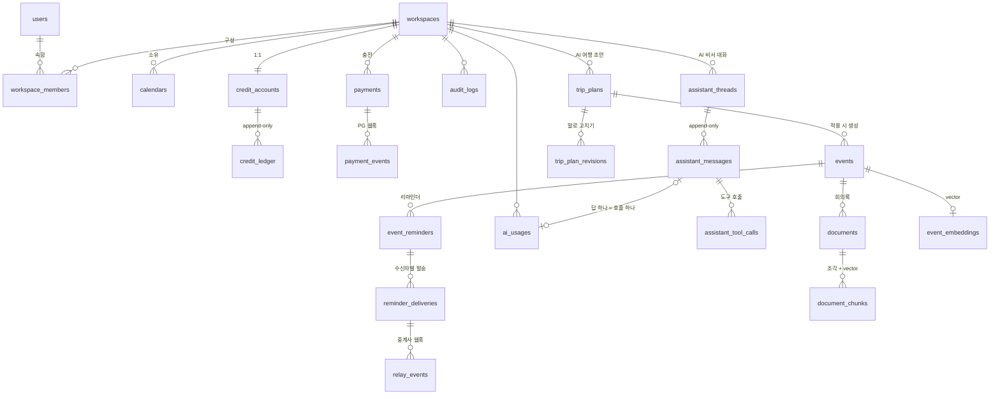

# Plandit 데이터 모델 — 확장분

기존 캘린더 모델(`User`, `Calendar`, `CalendarMember`, `Event`, `EventShare`, `PushSubscription` …)은 `packages/database/prisma/schema.prisma`가 기준이다.
이 문서는 **추가·변경되는 테이블**만 적는다. 1주차 범위는 ★.
ID는 기존과 같이 `cuid`. 시간순이 중요한 로그성 테이블(원장·이벤트·감사)만 `bigserial`.

## 관계

## ★ 변경되는 기존 테이블

### users
| 추가 컬럼 | 타입 | 비고 |
|---|---|---|
| phone | text null | 문자 리마인더 수신번호. 시드는 `010-0000-xxxx`만 |

### calendars
| 추가 컬럼 | 타입 | 비고 |
|---|---|---|
| workspace_id | FK workspaces | 마이그레이션 1단계 null 허용 → 백필(OWNER의 개인 워크스페이스) → 2단계 NOT NULL |

캘린더 역할(`CalendarRole`)은 그대로 둔다. 캘린더 안의 읽기/쓰기 권한은 캘린더 역할, 결제·크레딧·멤버 관리는 워크스페이스 역할.

## ★ 1주차 추가 테이블

### workspaces
| 컬럼 | 타입 | 비고 |
|---|---|---|
| id | cuid PK | |
| name | text | |
| type | enum PERSONAL / TEAM | 가입 시 PERSONAL 1개 자동 생성 |
| personal_owner_id | FK users unique null | PERSONAL일 때만. 사용자당 개인 워크스페이스 1개를 DB가 보장 |
| ai_monthly_credit_limit | int null | AI 월 한도(PLANDIT-24). null = 없음. 한 달은 Asia/Seoul 1일 0시부터. 사용량 = 그 달에 만든 ai_usages의 청구액 + 진행 중 예약의 선차감액 |
| created_at, updated_at | | |

### workspace_members
| 컬럼 | 타입 | 비고 |
|---|---|---|
| id | cuid PK | |
| workspace_id | FK | |
| user_id | FK users | |
| role | enum OWNER / ADMIN / MEMBER | `WorkspaceRole.covers(other)` |
| created_at | | |
| unique(workspace_id, user_id) | | |

규칙: 초대·역할 변경·제거는 ADMIN 이상이 자기 역할 이하로만. 본인 역할은 못 바꾼다. PERSONAL 워크스페이스는 멤버 추가 불가.

### credit_accounts — 워크스페이스당 하나
| 컬럼 | 타입 | 비고 |
|---|---|---|
| id | cuid PK | |
| workspace_id | FK unique | 워크스페이스 생성과 같은 트랜잭션 |
| balance | bigint | **원장에서 파생된 캐시** |
| updated_at | | |

### credit_ledger — append-only 원장
| 컬럼 | 타입 | 비고 |
|---|---|---|
| id | bigserial PK | 시간순 |
| account_id | FK | |
| type | enum CHARGE / DEBIT / REFUND / ADJUST | |
| amount | bigint | 부호 있음. CHARGE·REFUND 양수, DEBIT 음수 |
| balance_after | bigint | 기록 시점 잔액 |
| ref_type | enum PAYMENT / REMINDER_DELIVERY / AI_USAGE / MANUAL | |
| ref_id | text | 원인 객체 id |
| idempotency_key | text unique | `"{ref_type}:{ref_id}:{type}"` |
| memo | text null | |
| created_by | FK users null | 수동 조정 시 관리자 |
| created_at | | |

인덱스: (account_id, id desc), (ref_type, ref_id). UPDATE·DELETE는 트리거로 차단. 정정은 ADJUST 행 추가.

### payments — 충전 거래
| 컬럼 | 타입 | 비고 |
|---|---|---|
| id | cuid PK | |
| workspace_id, account_id | FK | |
| trade_id | text unique | `P{yyMMdd}-{seq}`, PG에 넘기는 값. seq는 DB 시퀀스 `payment_trade_seq` |
| provider | enum MOCK_PG | 확장: TOSS 등 |
| amount | int | 결제 금액(원) |
| credits | bigint | 지급 크레딧 |
| status | enum RESERVE / APPROVED / FAILED / CANCELED / UNKNOWN | |
| provider_tx_id | text unique null | PG 거래번호 |
| payment_page_url, method | text null | |
| failure_code, failure_message | text null | |
| requested_by | FK users | |
| created_at | timestamptz | = RESERVE 기록 시각(PG 호출 전) |
| approved_at, failed_at, canceled_at | timestamptz null | |
| ledger_id | FK credit_ledger null | 승인 시 CHARGE 행 |

상태 전이: RESERVE → APPROVED / FAILED / UNKNOWN; UNKNOWN → APPROVED / FAILED; APPROVED → CANCELED.

### payment_events — PG 웹훅 수신 기록
| 컬럼 | 타입 | 비고 |
|---|---|---|
| id | bigserial PK | |
| payment_id | FK null | trade_id로 못 찾은 이벤트도 남긴다 |
| event_id | text unique | 중복 수신 차단 키 |
| event_type | text | APPROVED / FAILED / CANCELED |
| payload | jsonb | 원문 |
| result | text | 처리 결과: APPLIED / ALREADY_APPLIED / UNKNOWN_PAYMENT / AMOUNT_MISMATCH / CONFLICT_STATE / UNHANDLED |
| received_at | | |

서명 실패 요청은 저장하지 않고 401(로그만). 같은 event_id 재수신은 INSERT가 무시되어 아무 처리도 하지 않는다.

### event_reminders — 일정별 리마인더 설정
| 컬럼 | 타입 | 비고 |
|---|---|---|
| id | cuid PK | |
| event_id | FK events (cascade) | |
| minutes_before | int | 0 ~ 10080(7일) |
| channel | enum PUSH / SMS / ALIMTALK | |
| audience | enum CREATOR / ATTENDEES | 받는 사람 범위 |
| created_by | FK users | |
| unique(event_id, minutes_before, channel) | | |

발송 시각 = `events.starts_at - minutes_before`(종일 일정은 캘린더 타임존 09:00 기준). 일정 시각이 바뀌면 새 jobId(`fire_{id}_{발송시각}`)로 예약하고, 옛 작업은 실행 시 현재 발송 시각과 달라 무시된다.

### reminder_deliveries — 수신자별 발송 건
| 컬럼 | 타입 | 비고 |
|---|---|---|
| id | cuid PK | |
| reminder_id | FK null | 일정·리마인더가 삭제돼도 발송 건은 남긴다(SetNull). 원장 행을 참조하기 때문 |
| user_id | FK users | |
| workspace_id | FK | 과금 워크스페이스(발송 시점 캘린더 소유) |
| channel | enum | |
| fire_at | timestamptz | 예정 발송 시각 |
| status | enum QUEUED / SENT / DELIVERED / FAILED / SKIPPED | |
| to_phone | text null | 발송 시점 번호 스냅샷(숫자만) |
| credits | int | 차감 크레딧(PUSH 0) |
| relay_msg_id | text unique null | 중계사 접수번호. 중계사에는 `clientRef = id`로 보내 재요청 멱등 |
| fail_code | text null | INVALID_NUMBER, RELAY_UNAVAILABLE, INSUFFICIENT_CREDITS … |
| fallback | text null | 유료 채널을 건너뛸 때 대체 결과(PUSH_SENT / PUSH_UNAVAILABLE) |
| debit_ledger_id, refund_ledger_id | FK credit_ledger unique null | |
| queued_at, sent_at, result_at | | |
| unique(reminder_id, user_id, fire_at) | | 같은 시각 중복 발송 차단 |

**중계사 호출 전에 QUEUED로 먼저 저장한다.**

### relay_events — 중계사 결과 웹훅
| 컬럼 | 타입 | 비고 |
|---|---|---|
| id | bigserial PK | |
| delivery_id | FK null | |
| event_id | text unique | |
| status | text | DELIVERED / FAILED |
| payload | jsonb | |
| result | text | APPLIED / ALREADY_APPLIED / UNKNOWN_DELIVERY |
| received_at | | |

### api_keys — 공개 API(`/v1/*`)용 개인 액세스 토큰 (PLANDIT-13)
| 컬럼 | 타입 | 비고 |
|---|---|---|
| id | cuid PK | |
| workspace_id | FK | 키가 접근할 수 있는 범위 |
| user_id | FK users | 발급자. 발급자의 권한을 넘는 스코프는 줄 수 없음 |
| name | text | 용도 메모 |
| prefix | text | 표시용 앞부분(`pk_` + 8자) |
| key_hash | text unique | SHA-256. **원문은 저장하지 않고 발급 응답에서 한 번만 보여줌** |
| scopes | text[] | `events:read`, `events:write`, `credits:read` |
| expires_at, last_used_at, revoked_at | timestamptz null | |
| created_at | | |

### audit_logs
| 컬럼 | 타입 | 비고 |
|---|---|---|
| id | bigserial PK | |
| workspace_id | FK null | |
| actor_id | FK users null | 시스템 작업이면 null |
| action | text | `workspace.member_role_changed`, `payment.approved` … |
| target_type, target_id | text | |
| payload | jsonb | 변경 전후, 처리 경로(`source`) |
| trace_id | text null | 요청의 X-Trace-Id. 로그와 연결 |
| ip, user_agent | text null | 최종 사용자 기준(web 프록시가 전달) |
| created_at | | |

UPDATE·DELETE는 트리거로 차단(원장과 같은 방식). 변경과 같은 트랜잭션에서 기록한다.

## 2주차 추가 테이블 (AI)

### ai_usages — LLM 호출 한 번의 과금 기록 (PLANDIT-20)
| 컬럼 | 타입 | 비고 |
|---|---|---|
| id | cuid PK | 원장 멱등키 `"AI_USAGE:{id}:DEBIT / ADJUST / REFUND"` |
| workspace_id, user_id | FK | 크레딧을 쓰는 워크스페이스, 요청한 사람 |
| feature | enum SCHEDULE_ASSISTANT / MEMORY_SEARCH / TRIP_PLANNER | |
| status | enum RESERVED / CALLING / SUCCEEDED / FAILED | RESERVED(선차감) → CALLING(호출 직전 기록) → SUCCEEDED·FAILED. RESERVED → FAILED도 있음(멈춘 건 정리) |
| provider | text | anthropic / mock |
| model | text null | 답을 만든 모델(서버 측 대체 시 대체 모델) |
| max_output_tokens | int | 선차감 계산에 쓴 출력 상한. 실행 요청이 이보다 크면 거절 |
| estimated_credits | int | 선차감액(DEBIT). 청구 상한 |
| credits | int | 청구액 = min(실사용, 선차감). 실패는 0 |
| input_tokens, output_tokens, cache_read_input_tokens, cache_write_input_tokens | int | 모든 시도의 합. 실패한 호출도 기록 |
| attempts | jsonb null | 시도별 `{ model, inputTokens, outputTokens, cacheRead…, cacheWrite… }` |
| failure_code | text null | LLM_TIMEOUT / LLM_RATE_LIMITED / LLM_OVERLOADED / LLM_UNAVAILABLE / LLM_BAD_REQUEST / LLM_AUTH / LLM_ERROR / LLM_REFUSED / LLM_TRUNCATED / INVALID_OUTPUT / STALE / INTERNAL |
| latency_ms | int null | |
| debit_ledger_id, adjust_ledger_id, refund_ledger_id | FK credit_ledger unique null | |
| created_at, started_at, finished_at | | started_at = CALLING 기록 시각 |

사용 건마다 `DEBIT + ADJUST + REFUND = −credits`.

### assistant_threads — AI 일정 비서 대화 (PLANDIT-21)
| 컬럼 | 타입 | 비고 |
|---|---|---|
| id | cuid PK | |
| workspace_id | FK | 크레딧을 쓰는 워크스페이스. 도구가 보는 캘린더도 이 워크스페이스 것 |
| user_id | FK users | 대화는 만든 사람만 본다 |
| title | text null | 첫 메시지 앞 40자 |
| status | enum IDLE / RUNNING / WAITING_APPROVAL | IDLE → RUNNING(메시지) → WAITING_APPROVAL(일정 변경 승인 대기) → RUNNING → … → IDLE |
| pending_usage_id | text unique null | 워커가 다음에 실행할, 선차감까지 끝난 AI 호출. 정산·실패 트랜잭션에서 비운다 |
| stop_code | text null | 차례가 일찍 끝난 이유: STEP_LIMIT / INSUFFICIENT_CREDITS / NOT_A_MEMBER / LLM 실패 코드 / STALE / INTERNAL. 다음 메시지가 지운다 |
| created_at, updated_at | | |

### assistant_messages — 모델에 보낸 그대로의 대화 (append-only)
| 컬럼 | 타입 | 비고 |
|---|---|---|
| id | cuid PK | |
| thread_id, seq | FK, int | unique(thread_id, seq). 같은 순번 두 번 쓰기를 막아 워커 재시도에도 한 번만 |
| kind | enum USER / ASSISTANT / TOOL_RESULTS | |
| text | text null | 화면용: 사용자가 쓴 말(USER), 답의 보이는 글(ASSISTANT) |
| content | jsonb | 모델에 보낸 `LlmMessage`. ASSISTANT는 받은 블록(thinking 포함)을 그대로 — Opus 5.5는 앞부분이 바뀐 대화의 thinking 블록을 거부하므로 고치지 않는다 |
| ai_usage_id | FK ai_usages unique null | ASSISTANT를 만든 호출 |

### assistant_tool_calls — 모델이 부른 도구
| 컬럼 | 타입 | 비고 |
|---|---|---|
| id | cuid PK | 승인·거절 API의 대상 |
| thread_id, message_id | FK | message = 도구를 부른 ASSISTANT 메시지 |
| tool_use_id | text | 모델의 호출 id(결과가 이 id로 답함). unique(thread_id, tool_use_id) |
| name, input | text, jsonb | |
| status | enum PENDING / WAITING_APPROVAL / DONE / ERROR / REJECTED | 읽기: PENDING → DONE·ERROR. 변경: PENDING → WAITING_APPROVAL(잘못된 입력이면 ERROR) → 승인 DONE·ERROR / 거절 REJECTED |
| preview | jsonb null | 승인 카드 내용(캘린더 이름·제목·현지 시각·참석자 이름) |
| output | jsonb null | 모델에 돌려준 결과 또는 `{ error }` |
| created_at, finished_at | | |

### trip_plans — AI 여행 일정 초안 (PLANDIT-26)
| 컬럼 | 타입 | 비고 |
|---|---|---|
| id | cuid PK | |
| workspace_id | FK | 크레딧을 쓰는 워크스페이스 |
| calendar_id | FK calendars | 일정을 넣을 캘린더(이 워크스페이스 소속) |
| created_by | FK users | 초안은 만든 사람만 조회·수정·적용 |
| request_key | text | `Idempotency-Key` 헤더. unique(created_by, request_key) — 두 번 눌러도 1건 |
| input | jsonb | 양식 입력(목적지·기간·참석자 userId·스타일). LLM에는 인원 수만 보냄 |
| draft | jsonb null | 검증을 통과한 모델 출력, 사용자가 `PATCH`로 고친 결과 |
| status | enum GENERATING / READY / FAILED / APPLIED | GENERATING → READY·FAILED, READY → APPLIED, 되돌리기 APPLIED → READY. FAILED는 AI 사용 건이 실패로 닫힐 때 같은 트랜잭션에서 |
| failure_code | text null | AI 사용 건의 실패 코드 그대로(LLM_TIMEOUT / INVALID_OUTPUT / STALE …) |
| ai_usage_id | FK ai_usages unique | 원장 멱등키 `"AI_USAGE:{ai_usage_id}:DEBIT / ADJUST / REFUND"`. 초안과 선차감은 한 트랜잭션에서 생긴다 |
| added_calendar_member_ids | text[] | 적용 때 캘린더에 VIEWER로 자동 추가한 사용자. 되돌리기 안내용(되돌려도 멤버는 남음) |
| created_at, updated_at, applied_at | | |

### trip_plan_revisions — 여행 초안을 말로 고치기 (PLANDIT-27)
| 컬럼 | 타입 | 비고 |
|---|---|---|
| id | cuid PK | |
| trip_plan_id | FK trip_plans (cascade) | |
| request_key | text | `Idempotency-Key`. unique(trip_plan_id, request_key) — 두 번 눌러도 1건 |
| request | text | 사용자가 쓴 요청(300자까지). LLM에는 데이터로만 |
| base_draft | jsonb | AI에게 준 초안. 반영할 때 초안이 이것과 같아야 함(손으로 고친 것을 덮어쓰지 않게) |
| proposed_draft | jsonb null | AI가 고친 초안 전체(검사 통과분) |
| status | enum PENDING / PROPOSED / ACCEPTED / DISCARDED / FAILED | 반영해야 초안이 바뀜. 실패는 전액 환불 |
| failure_code | text null | AI 사용 건의 실패 코드 |
| ai_usage_id | FK ai_usages unique | 원장 멱등키 `"AI_USAGE:{ai_usage_id}:…"` |
| created_at, decided_at | | |

### events (변경)
| 추가 컬럼 | 타입 | 비고 |
|---|---|---|
| trip_plan_id | FK trip_plans null | 여행 초안으로 만든 일정. "되돌리기"는 이 값으로 지운다 |

### documents — 일정에 붙인 회의록 (PLANDIT-22)
| 컬럼 | 타입 | 비고 |
|---|---|---|
| id | cuid PK | |
| event_id | FK events (cascade) | 그 일정을 볼 수 있는 사람만 검색(일정 목록과 같은 공개 범위). 일정이 지워지면 함께 |
| uploaded_by_id | FK users | 올린 사람. 올리기·지우기는 일정을 수정할 수 있는 사람 |
| filename, mime_type, size_bytes, char_count | | PDF·TXT·MD, 5MB·20만 자까지. **원본 파일은 저장하지 않는다** — 뽑은 글자만 조각으로 |
| status | enum PROCESSING / READY | 조각의 임베딩이 다 되면 READY. 글자를 읽을 수 없는 파일은 올릴 때 거절(행 없음) |
| created_at, ready_at | | |

### document_chunks
| 컬럼 | 타입 | 비고 |
|---|---|---|
| id | cuid PK | |
| document_id, seq | FK documents (cascade), int | unique(document_id, seq). 약 800자, 100자 겹침, 줄·문장 끝에서 자름 |
| content | text | |
| model | text null | 임베딩을 만든 모델. 지금 모델과 다르면 워커가 다시 만든다(검색은 지금 모델 것만) |
| embedding | vector(384) null | HNSW 코사인 인덱스 |

### event_embeddings
| 컬럼 | 타입 | 비고 |
|---|---|---|
| event_id | PK, FK events (cascade) | |
| content_hash | text | 제목·장소·설명의 sha256. 시간만 옮긴 일정은 다시 임베딩하지 않음 |
| model | text | |
| embedding | vector(384) | HNSW 코사인 인덱스 |
| updated_at | | 일정의 updated_at보다 이르면 워커가 다시 확인 |

임베딩은 무료(서버 CPU의 로컬 모델 `multilingual-e5-small`, 테스트는 글자 조각 해싱). pgvector 확장은 이 마이그레이션에서 켠다.

## 모의 서버 테이블 (스키마 `mock`)

`apps/mocks`가 기동 시 직접 만든다. 제품 Prisma 스키마에는 넣지 않는다(실제 PG·중계사의 DB도 우리 것이 아니므로).

- `mock.pg_transactions`: tx_id, merchant_trade_id(unique), amount, scenario, status(READY/APPROVED/FAILED/CANCELED), method, failure_code, return_url, webhook_url, created_at, approved_at, canceled_at
- `mock.pg_events`: event_id, tx_id, type, payload(jsonb), sent_count, last_http_status — 재전송용 원문 보관
- `mock.relay_messages`: msg_id, client_ref, phone, kind, body, status(ACCEPTED/DELIVERED/FAILED), fail_code, callback_url, event_id, sent_count, last_http_status, created_at, result_at — 가상 수신함의 데이터
